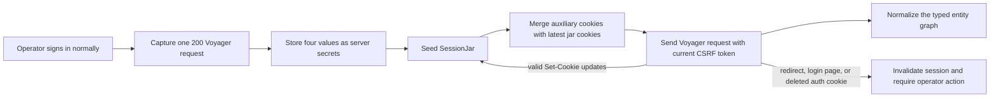

# LinkedIn Profile API

A browserless Node.js HTTP API that accepts a canonical LinkedIn people-profile URL, calls LinkedIn's internal Voyager endpoint directly, reconstructs the normalized response graph, and returns a stable JSON profile schema.

The response includes name, headline, location, about, experience, education, skills, certifications, languages, and profile/background images when those fields are available to the backend LinkedIn session.

## Features

- Direct HTTPS requests to LinkedIn Voyager; no Puppeteer, Playwright, Selenium, or browser runtime
- Canonical LinkedIn people-profile URL validation
- Normalized JSON output independent of LinkedIn's internal graph references
- Per-section completeness metadata and warnings
- Bounded response size, request timeout, one-request concurrency guard, and `429` cooldown handling
- Ten-minute in-memory cache for up to 100 normalized profiles
- Per-IP limit of 30 profile requests every 15 minutes
- LinkedIn cookie updates captured in a server-side session jar
- JSON health and profile endpoints suitable for HTTPS deployment

## Requirements

- Node.js 20 or newer
- npm
- A backend-owned LinkedIn session that can access the requested profiles
- The complete cookie and User-Agent context from one successful LinkedIn Voyager request

## Setup

### 1. Clone and install

```bash
git clone https://github.com/ph03iA/Profile-API.git
cd Profile-API
npm install
```

### 2. Create the environment file

Copy `.env.example` to `.env`:

```powershell
Copy-Item .env.example .env
```

On macOS or Linux:

```bash
cp .env.example .env
```

Configure the following values from the same working LinkedIn browser session:

```dotenv
LINKEDIN_LI_AT='your_li_at_value'
LINKEDIN_JSESSIONID='your_jsessionid_value_without_surrounding_quotes'
LINKEDIN_COOKIE_HEADER='the_complete_cookie_request_header'
LINKEDIN_USER_AGENT='the_complete_user_agent_request_header'
TRUST_PROXY_HOPS=
PORT=8080
```

| Variable | Required | Description |
| --- | --- | --- |
| `LINKEDIN_LI_AT` | Yes | Value of the authenticated `li_at` cookie. |
| `LINKEDIN_JSESSIONID` | Yes | Value of `JSESSIONID`, normally beginning with `ajax:`. Surrounding cookie quotes are optional. |
| `LINKEDIN_COOKIE_HEADER` | Yes | Complete `Cookie` request-header value from the same successful Voyager request. |
| `LINKEDIN_USER_AGENT` | Yes | Complete browser `User-Agent` request-header value associated with that session. |
| `TRUST_PROXY_HOPS` | No | Number of trusted reverse-proxy hops used to identify caller IPs. Use `1` only when the app is behind one trusted proxy. |
| `PORT` | No | HTTP port. Defaults to `8080`. |

`LINKEDIN_LI_AT` and `LINKEDIN_JSESSIONID` must exactly match their corresponding values inside `LINKEDIN_COOKIE_HEADER`. These values authenticate the LinkedIn account. Never paste them into an issue, log them, or commit `.env`.

### 3. Capture the LinkedIn values from your browser

Use only a LinkedIn session that you own and are authorized to use. The values captured below are active credentials: anyone who obtains them may be able to use that LinkedIn session.

Use **Google Chrome only** for this step. In our testing, using Brave caused the LinkedIn browser session to be logged out or replaced while the captured session was being used, possibly because of Brave Shields or its privacy protections. If you previously captured the values from Brave, sign in again with Chrome and capture every LinkedIn value from the same Chrome session. Do not mix cookie values from different browsers or login sessions.

1. Sign in normally at `https://www.linkedin.com/`.
2. Open `https://www.linkedin.com/feed/` and confirm the account is still signed in.
3. Open Chrome DevTools with `F12` or `Ctrl+Shift+I`.
4. Select **Network**, make sure recording is enabled, select **All**, and clear existing requests.
5. Select **Console** and run the following code. Replace `your-public-identifier` with the part after `/in/` in a LinkedIn profile URL.

```js
const slug = "your-public-identifier";

const jsessionCookie = document.cookie
  .split("; ")
  .find(cookie => cookie.startsWith("JSESSIONID="));

if (!jsessionCookie) {
  throw new Error("JSESSIONID is unavailable. Sign in again and reload LinkedIn.");
}

const csrfToken = jsessionCookie
  .slice("JSESSIONID=".length)
  .replace(/^"|"$/g, "");

const url =
  "https://www.linkedin.com/voyager/api/identity/dash/profiles" +
  "?q=memberIdentity" +
  `&memberIdentity=${encodeURIComponent(slug)}` +
  "&decorationId=com.linkedin.voyager.dash.deco.identity.profile.FullProfileWithEntities-101";

const response = await fetch(url, {
  credentials: "include",
  headers: {
    accept: "application/vnd.linkedin.normalized+json+2.1",
    "csrf-token": csrfToken,
    "x-li-lang": "en_US",
    "x-restli-protocol-version": "2.0.0"
  }
});

const payload = await response.json();
console.log({
  status: response.status,
  includedEntities: Array.isArray(payload.included) ? payload.included.length : 0
});
```

The Console must show status `200`. Do not continue with values from a `401`, `403`, checkpoint, or login response.

6. Return to **Network** and filter by:

```text
memberIdentity=your-public-identifier
```

7. Select the request with all of these properties:

   - Method: `GET`
   - Status: `200`
   - URL path: `/voyager/api/identity/dash/profiles`

8. Open **Headers** and locate **Request Headers**. Copy values locally using this mapping:

| DevTools request value | `.env` variable | What to copy |
| --- | --- | --- |
| `cookie` | `LINKEDIN_COOKIE_HEADER` | The entire header value, containing every semicolon-separated cookie. Do not include the `cookie:` label. |
| `user-agent` | `LINKEDIN_USER_AGENT` | The complete User-Agent value. Do not include the `user-agent:` label. |
| `li_at=...` inside `cookie` | `LINKEDIN_LI_AT` | Only the value after `li_at=` and before the next semicolon. |
| `JSESSIONID="ajax:..."` inside `cookie` | `LINKEDIN_JSESSIONID` | Only the value inside the quotes, normally beginning with `ajax:`. |

The finished local file should have this form:

```dotenv
LINKEDIN_LI_AT='value-copied-from-li_at'
LINKEDIN_JSESSIONID='ajax:value-copied-from-JSESSIONID'
LINKEDIN_COOKIE_HEADER='bcookie=...; JSESSIONID="ajax:..."; ...; li_at=...; ...'
LINKEDIN_USER_AGENT='Mozilla/5.0 ...'
TRUST_PROXY_HOPS=
PORT=8080
```

Important:

- Copy all four values from the same successful request.
- Keep the complete cookie header on one `.env` line and wrap it in single quotes.
- Do not paste real values into the README, GitHub, chat, screenshots, logs, or API requests.
- Do not log out of LinkedIn after capturing the values; logging out revokes the session. Closing the browser without logging out is fine.
- If the backend reports a rejected or unavailable session, sign in normally again and replace all four values from a new successful request.

### 4. Start the API

```bash
npm start
```

Verify it is running:

```bash
curl http://localhost:8080/health
```

Expected response:

```json
{
  "status": "ok"
}
```

## Why these LinkedIn session values are required

The public API accepts only a profile URL. API callers never submit LinkedIn credentials. Every upstream request is made through one LinkedIn session owned and provisioned by the backend operator, matching the assignment requirement to keep credentials on the server.

LinkedIn does not provide this project with an official OAuth scope for reading all required fields from arbitrary people profiles. The implementation therefore uses the authenticated web session that LinkedIn creates after the operator signs in normally.

Only the provisioning step uses a normal browser. The deployed application itself remains browserless: it does not launch Chrome, automate a login form, or solve CAPTCHA/checkpoints.

### What each value does

| Value | Purpose |
| --- | --- |
| `LINKEDIN_LI_AT` | The primary authenticated LinkedIn session cookie. It establishes which backend-owned LinkedIn session is making the request. |
| `LINKEDIN_JSESSIONID` | LinkedIn's session/CSRF synchronization value. The client removes surrounding cookie quotes and sends the current value as the `csrf-token` request header. |
| `LINKEDIN_COOKIE_HEADER` | Preserves the complete auxiliary cookie context from a request that LinkedIn already accepted. It includes routing, locale, device/session, and other browser cookies in addition to `li_at` and `JSESSIONID`. |
| `LINKEDIN_USER_AGENT` | Preserves the browser client identity associated with the accepted session context. |

The implementation does not claim that every auxiliary cookie is independently mandatory. It preserves the complete successful request context instead of guessing which private LinkedIn cookies may be checked at a particular time.

### How this setup was derived

The final four-value setup came from progressively comparing failing backend requests with a successful request made by the signed-in browser:

1. **`li_at` alone was insufficient.** The old HTML scraper could occasionally read basic identity data with only `li_at`, but it did not reliably return the required profile sections.
2. **Voyager also required CSRF synchronization.** A direct Voyager request without `csrf-token` returned `403`. Supplying the unquoted `JSESSIONID` value as `csrf-token` made the same browser request return `200`.
3. **Two cookies were not a stable request context.** During development, a freshly copied `li_at`/`JSESSIONID` pair could be accepted initially, while a later backend request was redirected, rejected, or received authentication-cookie deletion headers.
4. **The browser sent substantially more context.** The successful DevTools request contained the same authentication pair plus the complete auxiliary cookie set and the browser User-Agent.
5. **All values were captured from one request.** Mixing an older `li_at` with a newer full cookie header failed validation. Making all four values come from the same `200` request removed that mismatch.
6. **The matching backend request succeeded live.** With the complete session context, the direct Dash Voyager request returned typed identity, experience, education, skills, certifications, languages, and image entities.

This does not mean `li_at` is guaranteed to rotate after every request. LinkedIn may update, retain, reject, or delete cookies depending on the session and response. The client therefore processes actual `Set-Cookie` instructions rather than assuming a fixed rotation schedule.

### Runtime session lifecycle



At runtime:

1. `SessionJar` starts with `LINKEDIN_LI_AT` and `LINKEDIN_JSESSIONID`.
2. `VoyagerHttpClient` merges the complete browser cookie header with the jar. Values currently held by the jar override duplicates in the original header, so an accepted update is not replaced by an older seed value.
3. The latest `JSESSIONID` becomes the `csrf-token` header.
4. Valid LinkedIn `Set-Cookie` responses update the bounded jar.
5. Updated state is stored in `.sessions/linkedin.json`, which is ignored by Git and created with restrictive filesystem permissions.
6. Redirects, HTML login/checkpoint responses, authentication-cookie deletion, and rejected sessions stop extraction and return a controlled session error. The backend does not repeatedly retry a rejected session.
7. When operator action is required, all four environment values must be replaced from a new successful browser request and the service restarted.

### Security boundary

- `li_at`, `JSESSIONID`, the complete Cookie header, and `.sessions/linkedin.json` must all be treated like passwords.
- These values must never be returned by the API, accepted in the profile request body, committed to Git, or written to logs.
- Deployment variables should be sealed where supported, and `.sessions` should not be placed on publicly accessible or unnecessary persistent storage.
- Someone calling `/v1/profiles` cannot directly download `.sessions`, but an unprotected public endpoint can still consume the backend session by triggering upstream requests. Add API-user authentication and identity-aware limiting before broad public exposure.
- Revoke the LinkedIn session after the evaluation is complete.

## API documentation

Local base URL:

```text
http://localhost:8080
```

Replace it with the public HTTPS domain after deployment.

### `GET /`

Returns service metadata and the primary routes.

```json
{
  "name": "LinkedIn Profile HTTP Client",
  "transport": "linkedin-voyager",
  "endpoints": {
    "health": "GET /health",
    "profile": "POST /v1/profiles"
  }
}
```

### `GET /health`

Lightweight liveness endpoint. It does not contact LinkedIn.

```json
{
  "status": "ok"
}
```

### `POST /v1/profiles`

Fetches and normalizes one LinkedIn people profile.

Request headers:

```http
Content-Type: application/json
Accept: application/json
```

Request body:

```json
{
  "profileUrl": "https://www.linkedin.com/in/example/"
}
```

The URL must:

- Use `https`
- Use `linkedin.com` or `www.linkedin.com`
- Match `/in/{publicIdentifier}`
- Not contain credentials, a port, query parameters, or a fragment

Both profile routes share one in-memory limit of 30 requests per IP every 15 minutes, plus a service-wide limit of 100 profile requests per 15 minutes. IPv6 callers are grouped by `/64` subnet. Cache hits and failed requests also count. `/` and `/health` are not limited.

Successful profiles are cached for 10 minutes, up to 100 profiles. The API never caches errors, cookies, request headers, or raw Voyager responses.

Response headers show the current state:

- `X-Cache: MISS` means the API contacted LinkedIn.
- `X-Cache: HIT` means the API returned a cached normalized profile.
- `X-RateLimit-Remaining` shows the remaining requests for the caller.
- `X-RateLimit-Global-Remaining` shows the remaining service-wide requests.
- `Retry-After` is returned with a local `429` response.

Example request:

```bash
curl -X POST http://localhost:8080/v1/profiles \
  -H "Content-Type: application/json" \
  -H "Accept: application/json" \
  -d '{"profileUrl":"https://www.linkedin.com/in/example/"}'
```

#### Test the deployed API with Postman

The reviewer does not need to enter LinkedIn cookies or any authorization token in Postman. The backend owns the LinkedIn session.

1. Create a request with method `GET` and this URL:

   ```text
   https://your-service.up.railway.app/health
   ```

   Send it and confirm that the response status is `200` and the body is `{ "status": "ok" }`.

2. Create another request with method `POST` and this URL:

   ```text
   https://your-service.up.railway.app/v1/profiles
   ```

3. In the **Authorization** tab, select **No Auth**.
4. In the **Headers** tab, add `Content-Type: application/json` and `Accept: application/json`.
5. In **Body**, select **raw**, choose **JSON**, and enter:

   ```json
   {
     "profileUrl": "https://www.linkedin.com/in/prajwalchahande/"
   }
   ```

6. Select **Send**. A successful request returns status `200` and a normalized profile object.
7. Send the same request one more time and inspect the response headers. The first successful request normally has `X-Cache: MISS`; the repeated request should have `X-Cache: HIT` while the ten-minute cache entry remains valid.

Do not repeatedly send the request: profile requests count toward the documented local and service-wide limits.

Successful response shape:

```json
{
  "canonicalUrl": "https://www.linkedin.com/in/example/",
  "publicIdentifier": "example",
  "firstName": "Example",
  "lastName": "Person",
  "fullName": "Example Person",
  "headline": "Software Engineer",
  "location": "Example City",
  "about": "Profile summary when available.",
  "experience": [
    {
      "title": "Software Engineer",
      "company": "Example Company",
      "employmentType": "Full-time",
      "location": "Example City",
      "startDate": { "year": 2024, "month": 1 },
      "endDate": null,
      "isCurrent": true,
      "description": "Role description when available."
    }
  ],
  "education": [
    {
      "school": "Example University",
      "degree": "Bachelor of Engineering",
      "fieldOfStudy": "Computer Science",
      "startDate": { "year": 2020, "month": null },
      "endDate": { "year": 2024, "month": null },
      "description": null
    }
  ],
  "skills": [
    {
      "name": "JavaScript",
      "endorsementCount": null
    }
  ],
  "certifications": [
    {
      "name": "Example Certification",
      "issuer": "Example Issuer",
      "issueDate": { "year": 2025, "month": 1 },
      "expirationDate": null,
      "credentialId": null,
      "credentialUrl": null
    }
  ],
  "languages": [
    {
      "name": "English",
      "proficiency": "Professional working proficiency"
    }
  ],
  "images": {
    "profile": [
      {
        "url": "https://media.licdn.com/example-profile-image",
        "width": 400,
        "height": 400
      }
    ],
    "background": []
  },
  "meta": {
    "requestId": "generated-request-id",
    "fetchedAt": "2026-08-29T00:00:00.000Z",
    "sectionStatus": {
      "identity": "complete",
      "experience": "complete",
      "education": "complete",
      "skills": "partial",
      "certifications": "complete",
      "languages": "complete",
      "images": "complete"
    },
    "warnings": [],
    "transport": "linkedin-voyager"
  }
}
```

Nullable scalar fields and empty arrays are expected when LinkedIn does not expose a value. Use `meta.sectionStatus` and `meta.warnings` to distinguish an unavailable or partially parsed section from a genuinely empty section.

Section states:

| State | Meaning |
| --- | --- |
| `complete` | The supported fields for the section were reconstructed successfully. |
| `partial` | Some section data was returned, but one or more supported fields could not be resolved. |
| `unavailable` | The section was absent, hidden, or unsupported in the upstream response. |

### Compatibility route

The original client route remains available:

```text
GET /request?linkedinUrl=https://www.linkedin.com/in/example/
```

New integrations should use `POST /v1/profiles`.

### Error responses

Versioned API errors use this shape:

```json
{
  "error": {
    "code": "PROFILE_NOT_FOUND",
    "message": "The profile was not found."
  }
}
```

| HTTP status | Possible code | Meaning |
| --- | --- | --- |
| `400` | `INVALID_REQUEST`, `INVALID_PROFILE_URL` | Missing or invalid profile URL. |
| `404` | `PROFILE_NOT_FOUND` | LinkedIn did not expose the requested profile to the backend session. |
| `429` | `RATE_LIMITED`, `LINKEDIN_THROTTLED` | The local per-IP allowance was used or LinkedIn asked the service to slow down. |
| `502` | `UPSTREAM_SCHEMA_CHANGED`, `UPSTREAM_UNAVAILABLE` | Voyager returned an unsupported response or was unavailable. |
| `503` | `LINKEDIN_SESSION_UNAVAILABLE`, `SERVICE_BUSY` | The session requires attention or another profile request is already running. |
| `504` | `UPSTREAM_TIMEOUT` | LinkedIn did not respond before the configured timeout. |

## My approach

I kept the public API independent from LinkedIn's private response format by separating transport, graph reconstruction, and normalization:

### Why I chose Voyager instead of RSC

I evaluated two browserless ways to request profile data directly from LinkedIn:

| Approach | What it returns | Trade-off |
| --- | --- | --- |
| RSC/SDUI | A React Server Components data stream used by LinkedIn's web interface | The stream is tied to internal UI components and actions. It needs a custom decoder, and the payload I evaluated did not reliably contain one complete profile. Details such as About and lazy-loaded sections could be absent or require separate actions. |
| Voyager | Normalized JSON containing typed entities connected by URNs | The schema is still private and can change, but it is easier to validate, bound, reconstruct, and map into a stable API response. |

I chose Voyager as the production transport because one expanded profile request provides the profile root plus linked experience, education, skills, certifications, languages, and image entities. Its JSON graph gives each entity a declared type and relationship, which lets the API avoid collecting unrelated records from the response. It also makes response-size limits, schema checks, pagination metadata, and upstream error handling more predictable.

RSC was not rejected because it uses a browser—it can also be called directly over HTTP. I did not choose it as the primary transport because its Flight stream and internal component identifiers are more closely coupled to LinkedIn's frontend and were less consistent for full-profile extraction. Voyager can still return an incomplete paginated section; when that happens, this API returns the supported entries with `SECTION_PARTIAL` instead of claiming that the section is complete.

1. **Validate the input.** The client parses the submitted URL and accepts only canonical LinkedIn people-profile URLs. This prevents arbitrary outbound requests and extracts the public profile identifier.
2. **Build an authenticated browserless request.** The HTTP client calls LinkedIn's internal `identity/dash/profiles` Voyager endpoint using Node's built-in `fetch`. It supplies the matching cookie context, CSRF token, User-Agent, Rest.li protocol header, and profile decoration identifier.
3. **Bound the upstream interaction.** The client enforces a timeout and maximum response size, follows no redirects, allows only one in-flight profile request, and honors LinkedIn throttling responses.
4. **Reconstruct the normalized graph.** Voyager returns entities connected by URNs and reference fields rather than one flat profile. The graph layer indexes those entities and resolves profile, position, education, skill, certification, language, and image references.
5. **Normalize the result.** Dedicated parsers map LinkedIn's internal objects into a stable response schema with predictable nulls, arrays, dates, image variants, section states, and warnings.
6. **Handle session updates.** A bounded server-side cookie jar absorbs valid LinkedIn `Set-Cookie` updates and uses the latest `JSESSIONID` as the CSRF token. Redirects, deleted authentication cookies, login pages, and checkpoints invalidate the session instead of being retried blindly.
7. **Expose clear API failures.** Upstream conditions are translated into stable HTTP statuses and error codes without returning session credentials or raw LinkedIn responses.

Key modules:

| Module | Responsibility |
| --- | --- |
| `src/VoyagerHttpClient.js` | Direct HTTPS transport, headers, bounds, timeouts, and upstream status handling. |
| `src/SessionJar.js` | Server-side LinkedIn cookie state and CSRF synchronization. |
| `src/ProfileCache.js` | Bounded ten-minute cache for normalized profiles. |
| `src/IpRateLimiter.js` | Bounded per-IP request limiter for profile routes. |
| `src/voyager/graph.js` | Normalized graph indexing and reference resolution. |
| `src/voyager/identity.js` | Identity and profile-root extraction. |
| `src/voyager/sections.js` | Experience, education, skills, certifications, and languages. |
| `src/voyager/images.js` | Profile and background image variants. |
| `src/VoyagerNormalizer.js` | Stable API response assembly and metadata. |
| `src/server.js` | Express routes and HTTP error mapping. |

## Deployment

For Railway or a comparable Node.js host:

1. Deploy this GitHub repository as a service.
2. Use `npm start` as the start command.
3. Add the four required LinkedIn values as service variables; seal them when the platform supports sealed variables.
4. Leave `TRUST_PROXY_HOPS` empty unless every request passes through trusted proxies that replace forwarded-IP headers. If the deployment guarantees one trusted proxy hop, set it to `1`.
5. Expose the application port supplied through `PORT`.
6. Use `/health` for liveness checks.
7. Do not attach persistent storage for `.sessions` unless persistence is explicitly required and separately protected.
8. Verify `POST /v1/profiles` through the public HTTPS domain.

The repository excludes `.env`, `.sessions/`, and `node_modules/`. Never place real credentials in `.env.example`.

### Session persistence trade-offs

The four LinkedIn environment variables seed the session at startup. When LinkedIn sends valid cookie updates, the server-side jar applies them and saves the current state in `.sessions/linkedin.json`.

| Deployment choice | Benefit | Trade-off |
| --- | --- | --- |
| Default ephemeral `.sessions` file | Reuses accepted cookie updates while that filesystem remains available, including a process restart that keeps the same filesystem. | A full redeployment or container replacement can remove the file. The next process then falls back to the original environment-variable values, which may be outdated. |
| In-memory-only jar | Writes no session credential file to disk. | Requires disabling file persistence, and every process restart loses accepted cookie updates. |
| Persistent volume | Keeps accepted cookie updates across redeployments and container replacements. | Stores valuable LinkedIn session credentials for longer and requires carefully restricted volume, backup, and operator access. |

The default ephemeral option is used for this controlled assignment deployment. A mock session test confirmed that a surviving state file lets a new `SessionJar` instance reuse updated `li_at` and `JSESSIONID` values; the same test without a state file fell back to the old startup values. This verifies the application behavior, but it does not guarantee that a hosting platform preserves its ephemeral filesystem during redeployment.

If the state file is lost and the original environment values are no longer accepted, capture all four values again from one successful Chrome Voyager request, update the deployment variables together, and restart the service.

## Security notes

- `.env` and `.sessions/linkedin.json` contain credentials equivalent to an authenticated LinkedIn session.
- The API response never intentionally includes cookie values or raw response headers.
- The profile URL validator permits only canonical LinkedIn people-profile URLs; it does not act as a general URL fetcher.
- The profile routes do not require API-user authentication. A modest in-memory IP limiter protects the backend LinkedIn session during the controlled evaluation.
- Revoke the LinkedIn session after the evaluation is complete.

## Known limitations

- Voyager is a private, undocumented LinkedIn interface. Its endpoint, decoration identifier, headers, and graph schema can change without notice.
- The implementation depends on a valid backend LinkedIn session and matching browser-cookie context.
- Expired cookies, CAPTCHA, checkpoints, account restrictions, and security verification require manual owner action.
- Profile visibility and relationship settings determine which fields the backend session can see.
- Only LinkedIn people-profile URLs are supported; company and organization pages are rejected.
- A `partial` or `unavailable` section does not prove that the LinkedIn profile has no entries in that section.
- Signed LinkedIn media URLs can expire.
- Only one upstream profile request is allowed at a time. This reduces session pressure but limits throughput.
- Cached profiles can be up to 10 minutes old. They keep the original `meta.fetchedAt`, but each API response receives a new `meta.requestId`.
- The cache and rate limiter are per process. They reset after a restart and are not shared across multiple replicas.
- There is no distributed session store or end-user authentication.
- Session cookies remain valuable credentials even when the session-state file is protected with filesystem permissions.

## Author

Built and maintained by [Prajwal Chahande](https://github.com/ph03iA).
